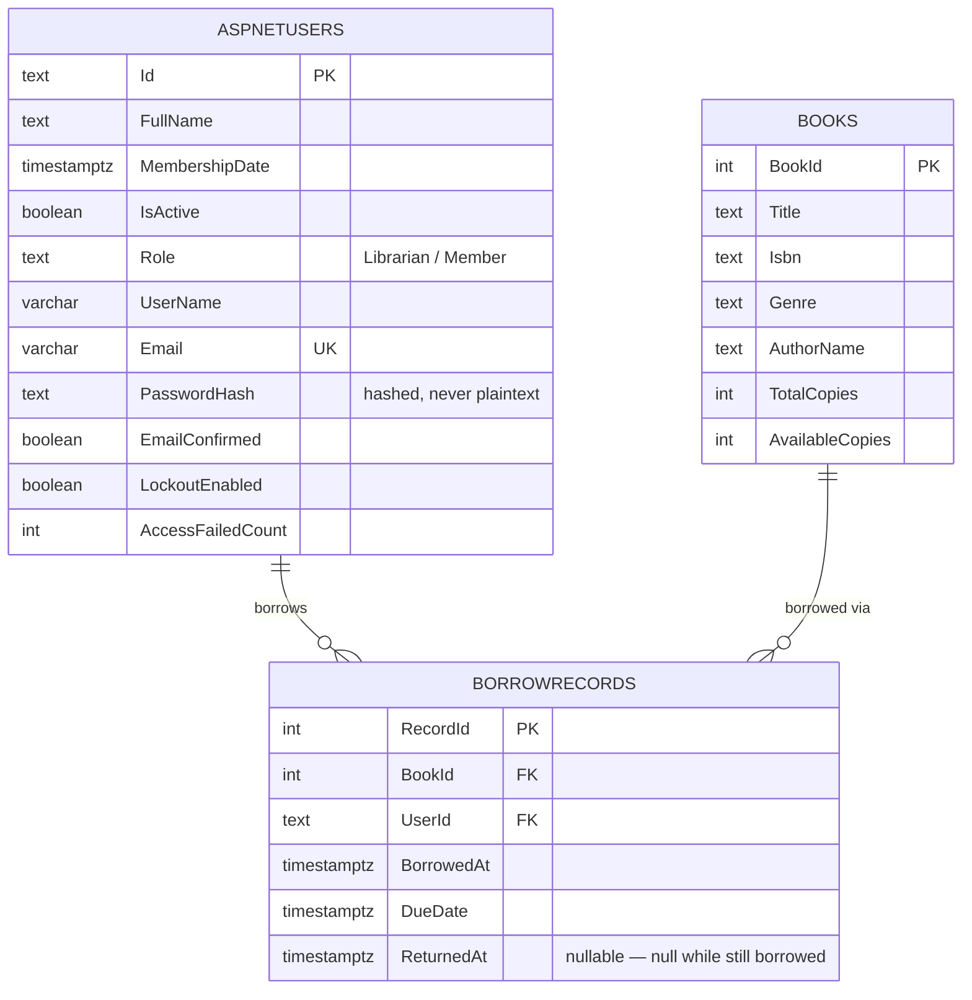

# LibraryWebApp — Database Design (PostgreSQL)

ER diagram and relational schema for the Library Management web app's backend.

**v1 — initial schema.** Single-database design, no multi-tenancy — one library, two roles
(`Librarian`, `Member`). Core chain: `AspNetUsers` (accounts, managed by ASP.NET Core Identity)
owns many `BorrowRecords`; a `Book` also owns many `BorrowRecords`.

**v2 — role moved onto a plain column.** v1 used ASP.NET Core Identity's built-in role tables
(`AspNetRoles` + `AspNetUserRoles`, a many-to-many join). Since this app only ever assigns exactly
one role per user, that flexibility bought nothing — so `AspNetRoles`, `AspNetUserRoles`, and
`AspNetRoleClaims` were dropped and replaced with a single `Role` column directly on `AspNetUsers`,
matching GlobeTrotter's simpler `users.role` pattern. `[Authorize(Roles = "Librarian")]` still works
unchanged, since that attribute reads the JWT's role claim either way — the JWT is now built by
reading `user.Role` directly instead of calling Identity's `GetRolesAsync()`. See Design Decisions
below for the full trade-off.

Schema is **code-first**: the tables below are generated from the C# entity classes in
`backend/Models/` + `backend/Data/ApplicationDbContext.cs` via EF Core migrations
(`backend/Migrations/`), not hand-written. The DDL in §4 is the actual SQL EF Core generated —
extracted with `dotnet ef migrations script`, not retyped by hand — so it's guaranteed to match
what's really running in `librarydb`.

---

## 1. Entity-Relationship Diagram



---

## 2. Table Summary & Relationships

| # | Table | Purpose | Key Relationships |
|---|-------|---------|-------------------|
| 1 | `AspNetUsers` | App account — both librarians and members are rows here, distinguished by `Role` | Root of borrowing chain; framework-managed by ASP.NET Core Identity |
| 2 | `Books` | Library catalog | owns BorrowRecords |
| 3 | `BorrowRecords` | One checkout event: a user borrowing a book | AspNetUsers 1→N, Books 1→N |
| — | `AspNetUserClaims` / `AspNetUserLogins` / `AspNetUserTokens` | Identity framework plumbing (external logins, 2FA tokens, per-user claims) | Not used by app logic yet, created automatically by Identity's schema — listed here for completeness, omitted from the diagram above since nothing in the app queries them directly |

No row-level tenancy needed — the only scoping rule is "a Member can only see their own
`BorrowRecords`", enforced in the controller layer from the logged-in user's ID in the JWT
(see `backend/Controllers/`), not the database.

---

## 3. Design Decisions

- **No separate `Members` table.** `ApplicationUser : IdentityUser` (in `Models/ApplicationUser.cs`)
  *is* the member record — it carries `FullName`, `MembershipDate`, `IsActive`, `Role` alongside
  Identity's built-in auth columns (`Email`, `PasswordHash`, etc.). A `Librarian` is the same row
  type with a different `Role` value — there's no separate person type to justify a second table,
  just a different permission level.
- **`Role` is a plain column on `AspNetUsers`, not Identity's role tables.** v1 used
  `AspNetRoles`/`AspNetUserRoles` (Identity's built-in many-to-many role system), which supports a
  user holding multiple roles at once. This app never needs that — every user has exactly one role,
  set once at registration/seed time — so the join-table flexibility was pure overhead. Switched to
  `ApplicationDbContext : IdentityUserContext<ApplicationUser>` (the role-less Identity base class,
  instead of `IdentityDbContext<ApplicationUser>`) plus `AddIdentityCore<ApplicationUser>()` (instead
  of `AddIdentity<ApplicationUser, IdentityRole>()`) in `Program.cs`, which together stop Identity
  from creating or managing the role tables at all. `[Authorize(Roles = "Librarian")]` on controllers
  is unaffected — it reads the JWT's role claim, which `TokenService` now populates from
  `user.Role` directly instead of `UserManager.GetRolesAsync()`.
- **`BorrowRecords.RecordId` needed an explicit `HasKey()` in `OnModelCreating`.** EF Core's default
  convention only auto-detects a primary key named `Id` or `{ClassName}Id` (i.e. `BorrowRecordId`);
  `RecordId` doesn't match either pattern, so without the explicit `modelBuilder.Entity<BorrowRecord>()
  .HasKey(r => r.RecordId)` line in `ApplicationDbContext.cs`, migration generation fails outright.
  Documented here since it's a genuine EF Core gotcha, not a design choice with alternatives.
- **`BorrowRecords.UserId` is `text`, not an integer.** ASP.NET Core Identity's default primary key
  type for users is a `string` (a GUID), not an auto-incrementing int — so every foreign key pointing
  at `AspNetUsers.Id` inherits that type, including `BorrowRecords.UserId`. This is an Identity
  convention, not something chosen per-table.
- **`ON DELETE RESTRICT` on both `BorrowRecords` foreign keys (`BookId` and `UserId`), not `CASCADE`.**
  A borrow record is historical proof that a checkout happened — deleting a `Book` or a user account
  that still has borrow history should be blocked, not silently wipe that history out from under it.
  This is the opposite default from GlobeTrotter's `trips` → `stops` cascade, because a `BorrowRecord`
  is closer to an audit log entry than to a child object that only exists because of its parent.
  (`DeleteBook`/`DeleteMember` logic in the controller layer is expected to check for active/any
  borrow history first and return a friendly error rather than relying on the DB constraint to fail.)
- **Indexes on `BorrowRecords.BookId` and `BorrowRecords.UserId`.** Both are the two lookups the app
  actually does at request time — "this book's full borrow history" and "this member's own borrow
  history" — so both get an index (`IX_BorrowRecords_BookId`, `IX_BorrowRecords_UserId`), same
  reasoning as GlobeTrotter's `idx_trip_user_id`.
- **No multi-tenancy / database-per-library.** One library, one database — row-level scoping
  (a member only sees their own records) is enforced in the controller from the JWT's user ID, the
  same shape as GlobeTrotter's `trips.user_id` check, just one level shallower since there's no
  `trips`-equivalent parent object here.
- **Schema is code-first via EF Core migrations, not a hand-maintained `schema.sql`.** The C# model
  classes are the single source of truth; `dotnet ef migrations add <Name>` generates the SQL diff,
  and `dotnet ef database update` applies it, tracked in `__EFMigrationsHistory`.

---

## 4. PostgreSQL DDL (as generated by EF Core)

Current schema after both migrations (`InitialCreate` + `SwitchToRoleColumn`) in
`backend/Migrations/` — extracted with `dotnet ef migrations script`, idempotency wrapper stripped
for readability. This reflects the current table shapes, not the migration-by-migration diff.

```sql
CREATE TABLE "AspNetUsers" (
    "Id" text NOT NULL,
    "FullName" text NOT NULL,
    "MembershipDate" timestamp with time zone NOT NULL,
    "IsActive" boolean NOT NULL,
    "UserName" character varying(256),
    "NormalizedUserName" character varying(256),
    "Email" character varying(256),
    "NormalizedEmail" character varying(256),
    "EmailConfirmed" boolean NOT NULL,
    "PasswordHash" text,
    "SecurityStamp" text,
    "ConcurrencyStamp" text,
    "PhoneNumber" text,
    "PhoneNumberConfirmed" boolean NOT NULL,
    "TwoFactorEnabled" boolean NOT NULL,
    "LockoutEnd" timestamp with time zone,
    "LockoutEnabled" boolean NOT NULL,
    "AccessFailedCount" integer NOT NULL,
    "Role" text NOT NULL DEFAULT '',
    CONSTRAINT "PK_AspNetUsers" PRIMARY KEY ("Id")
);

CREATE TABLE "Books" (
    "BookId" integer GENERATED BY DEFAULT AS IDENTITY,
    "Title" text NOT NULL,
    "Isbn" text NOT NULL,
    "Genre" text NOT NULL,
    "AuthorName" text NOT NULL,
    "TotalCopies" integer NOT NULL,
    "AvailableCopies" integer NOT NULL,
    CONSTRAINT "PK_Books" PRIMARY KEY ("BookId")
);

CREATE TABLE "AspNetUserClaims" (
    "Id" integer GENERATED BY DEFAULT AS IDENTITY,
    "UserId" text NOT NULL,
    "ClaimType" text,
    "ClaimValue" text,
    CONSTRAINT "PK_AspNetUserClaims" PRIMARY KEY ("Id"),
    CONSTRAINT "FK_AspNetUserClaims_AspNetUsers_UserId" FOREIGN KEY ("UserId") REFERENCES "AspNetUsers" ("Id") ON DELETE CASCADE
);

CREATE TABLE "AspNetUserLogins" (
    "LoginProvider" text NOT NULL,
    "ProviderKey" text NOT NULL,
    "ProviderDisplayName" text,
    "UserId" text NOT NULL,
    CONSTRAINT "PK_AspNetUserLogins" PRIMARY KEY ("LoginProvider", "ProviderKey"),
    CONSTRAINT "FK_AspNetUserLogins_AspNetUsers_UserId" FOREIGN KEY ("UserId") REFERENCES "AspNetUsers" ("Id") ON DELETE CASCADE
);

CREATE TABLE "AspNetUserTokens" (
    "UserId" text NOT NULL,
    "LoginProvider" text NOT NULL,
    "Name" text NOT NULL,
    "Value" text,
    CONSTRAINT "PK_AspNetUserTokens" PRIMARY KEY ("UserId", "LoginProvider", "Name"),
    CONSTRAINT "FK_AspNetUserTokens_AspNetUsers_UserId" FOREIGN KEY ("UserId") REFERENCES "AspNetUsers" ("Id") ON DELETE CASCADE
);

CREATE TABLE "BorrowRecords" (
    "RecordId" integer GENERATED BY DEFAULT AS IDENTITY,
    "BookId" integer NOT NULL,
    "UserId" text NOT NULL,
    "BorrowedAt" timestamp with time zone NOT NULL,
    "DueDate" timestamp with time zone NOT NULL,
    "ReturnedAt" timestamp with time zone,
    CONSTRAINT "PK_BorrowRecords" PRIMARY KEY ("RecordId"),
    CONSTRAINT "FK_BorrowRecords_AspNetUsers_UserId" FOREIGN KEY ("UserId") REFERENCES "AspNetUsers" ("Id") ON DELETE RESTRICT,
    CONSTRAINT "FK_BorrowRecords_Books_BookId" FOREIGN KEY ("BookId") REFERENCES "Books" ("BookId") ON DELETE RESTRICT
);

CREATE INDEX "IX_AspNetUserClaims_UserId" ON "AspNetUserClaims" ("UserId");
CREATE INDEX "IX_AspNetUserLogins_UserId" ON "AspNetUserLogins" ("UserId");
CREATE INDEX "EmailIndex" ON "AspNetUsers" ("NormalizedEmail");
CREATE UNIQUE INDEX "UserNameIndex" ON "AspNetUsers" ("NormalizedUserName");
CREATE INDEX "IX_BorrowRecords_BookId" ON "BorrowRecords" ("BookId");
CREATE INDEX "IX_BorrowRecords_UserId" ON "BorrowRecords" ("UserId");
```

**Regenerating this file:** if the schema changes (new migration added), re-run
`dotnet ef migrations script --idempotent -o /tmp/schema.sql` from `backend/` and paste the new
`CREATE TABLE`/`CREATE INDEX` statements in here — never hand-edit the DDL above independently of
an actual migration, or this document will drift from what's really running.
